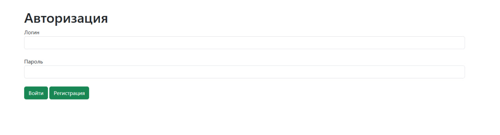
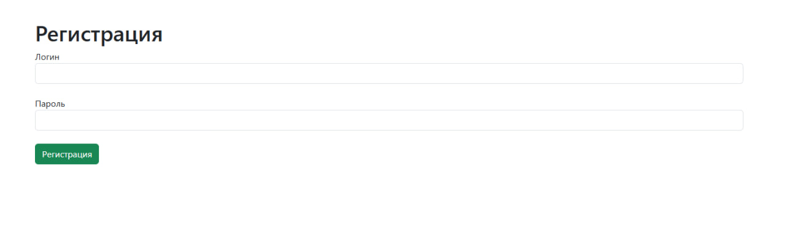
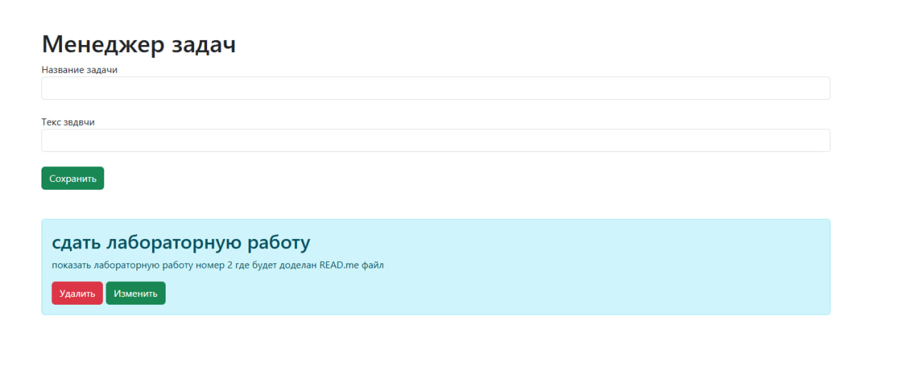

## Внешний вид проекта

/login

/registration

/base

## Дополнмительная информация для паботы с сайтом
в проекте имеется только 3 html файла. Основные методы завящанны с файлом view.html.
Для удаление информации в базе данных необходимо перейти по ссылке /clear_database.

